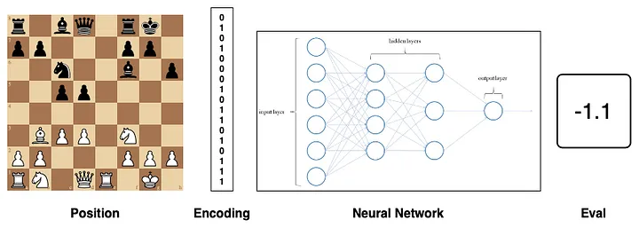

## Note and idea ♟️🎯

|                |              |               |               |               |                 |
|----------------|--------------|---------------|---------------|---------------| ----------------|   
|   night = n    |   king = k   |   pawn = p    |   bishop = b  |   queen = q   |   rook = r      |

### model:

1. MinMax algo 
2. Alpha-Beta
---
1. Create an environment: Implement an environment to manage chess rules.
2. Neural network: Train a model to evaluate positions or predict moves.
3. Monte Carlo Tree Search: Implement MCTS to explore moves intelligently.
4. Reinforcement learning: Play the model against itself to learn strategies.
5. Iteration: Increase network by generating data based on self played games.

*Train a model on existing chess sets, databases such as PGN. (Tensorflow - Pytorch)*

### schema:

